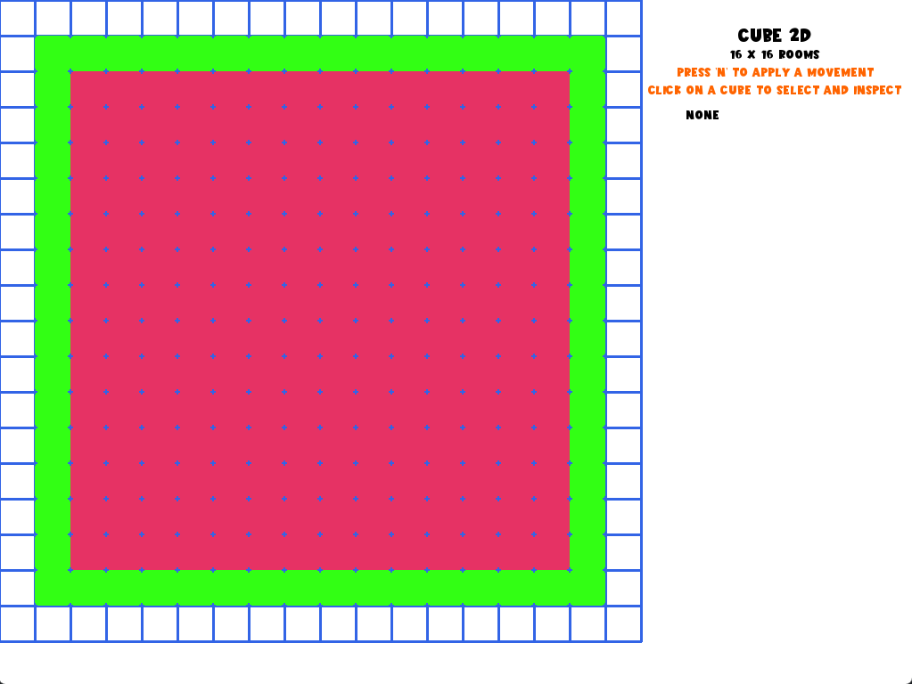

## About This

This project is used to explore some interesting patterns presented in [Cube](https://en.wikipedia.org/wiki/Cube_(1997_film)), a movie about individuals are trapped in cube-shaped rooms whose movement is governed by a mathematical mechanism.

There are some literatures expounding the math behind the movie:

>**Math Goes to the movies**
>**Cube: The Math Paper**

After some attemps, I have not found any exciting points worth be converting to a gameplay.